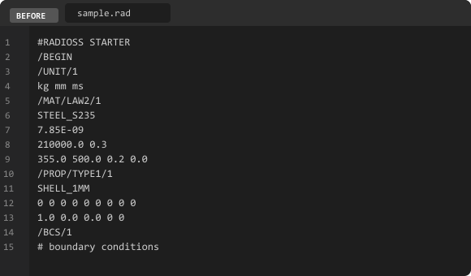
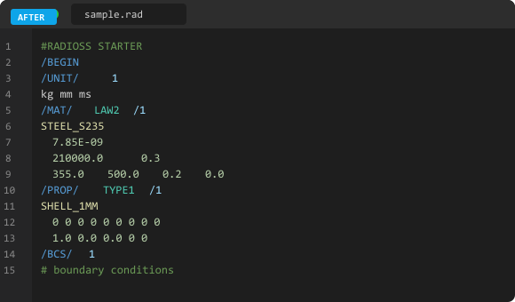

# OpenRadioss-language package

[](https://marketplace.visualstudio.com/items?itemName=Nakashin0212.OpenRadioss-language-package)
[](LICENSE)

Syntax highlighting and deck structure navigation for **OpenRadioss** CAE input files (`.rad`) in Visual Studio Code.

---

## Before / After

| Without extension | With extension |
|:-----------------:|:--------------:|
|  |  |

---

## Features

### Syntax Highlighting

Full coverage of OpenRadioss Starter input keywords, color-coded by category:

| Category | Examples |
|----------|---------|
| Block headers | `/BEGIN`, `/END`, `#RADIOSS STARTER` |
| Materials | `/MAT/LAW1` – `/MAT/LAW200`, `/HEAT/MAT`, `/NONLOCAL/MAT` |
| Properties | `/PROP/TYPE1` – `/PROP/TYPE45`, `/PROP/INJECT1` |
| Elements | `/NODE`, `/BRICK`, `/SHELL`, `/BEAM`, `/TETRA4`, `/PENTA6`, `/SPRING`, `/TRUSS` |
| Failure models | `/FAIL/JOHNSON`, `/FAIL/GURSON`, `/FAIL/HASHIN`, 40+ models |
| Equations of state | `/EOS/GRUNEISEN`, `/EOS/IDEAL-GAS`, 17+ EOS types |
| Boundary conditions | `/BCS`, `/IMPVEL`, `/IMPDISP`, `/CLOAD`, `/GRAV` |
| Contact/Interface | `/INTER/TYPE1` – `/INTER/TYPE25` and subtypes |
| Initial conditions | `/INIVEL`, `/INIBRI`, `/INISHE`, `/INIQUA` and subtypes |
| ALE / Fluid | `/ALE/GRID/*`, `/EBCS/*`, `/EULER/MAT` |
| Monitoring | `/MONVOL/*`, `/GAUGE`, `/TH` |
| Comments | `#` lines |
| Numbers | Integers, decimals, scientific notation (`1.5E-3`, `2.1D+4`) |
| Parameters | `&PARAM = value` |

### Deck Structure Panel

A dedicated panel in the Activity Bar shows all blocks in the open `.rad` file as a navigable tree. Click any entry to jump directly to that line.

- `/MAT`, `/PROP`, `/PART`, `/INTER`, `/FAIL` and all other blocks are listed
- Block name shown alongside the keyword
- Category icons for quick visual scanning
- Refresh button to force update

### Language Support

- Auto file association for `.rad` and `.radians`
- Bracket matching and auto-closing
- Line comment toggle (`#`)

---

## Installation

Search for **`OpenRadioss-language package`** in the VS Code Extensions panel (`Ctrl+Shift+X`).

---

## Example

```radioss
#RADIOSS STARTER
#---1----|----2----|----3----|----4----|----5----|----6----|----7----|----8----|----9----|---10----|
/UNIT/1
kg mm ms

/MAT/LAW2/1
STEEL_S235
  7.85E-09
  210000.0           0.3
  355.0      500.0   0.2       0.0

/PROP/TYPE1/1
SHELL_1MM
  0   0   0   0   0   0   0   0   0
  1.0     0.0     0.0     0     0

/PART/1
BODY_PANEL
         1         1         0

/NODE
         1       0.000       0.000       0.000
         2     100.000       0.000       0.000
         3     100.000     100.000       0.000

/BCS/1
         1  000000  000000
         2  000000  000000

/GRAV/1
GRAVITY
         1       9810.0
    0.0    0.0   -1.0

/END
```

---

## Links

- [OpenRadioss Official Documentation](https://openradioss.atlassian.net/)
- [OpenRadioss GitHub](https://github.com/OpenRadioss/OpenRadioss)
- [Issue Tracker](https://github.com/pjkachina/openradioss-language-support/issues)

---

MIT License — Copyright (c) 2026 Nakashin0212

## Trademark Notice

"OpenRadioss" and "Altair Radioss" are trademarks of Altair Engineering, Inc.
This extension is an independent project and is not affiliated with, endorsed by,
or sponsored by Altair Engineering, Inc.
